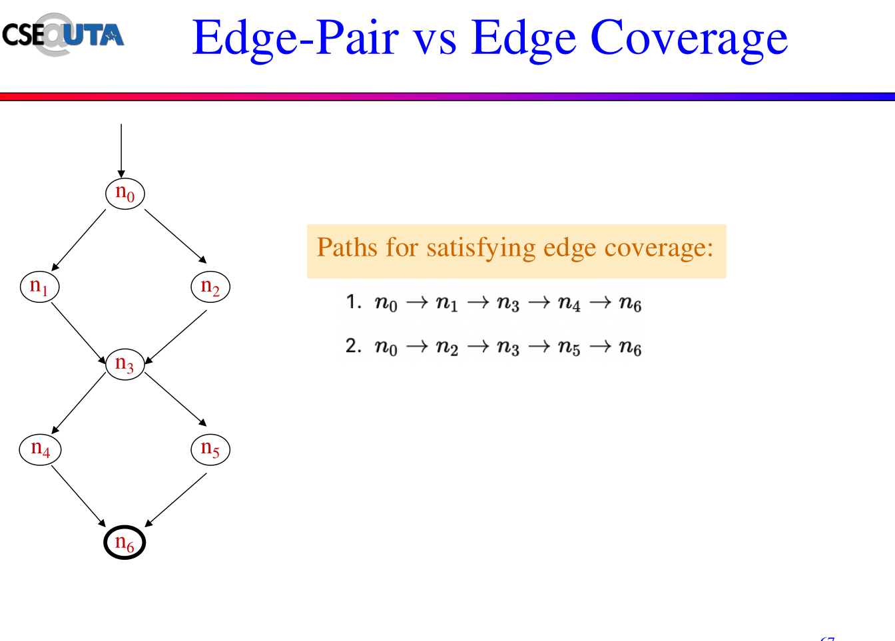

># Software Testing and Maintenance

> ## Difference between Developers and Testers
|Developer| Tester|
|- | -|
|Writitng Code| Testing Software|
|Creating software solutions| Identifying Bugs|
|Debugging and Trouble shooting| Quality Assurance|
|Ensuring Fuctionality| Ensuring Usability and Experience|

> Why test?
 - Cost Effective
 - Enhance Security
 - Performance
 - Reduce Risk

| Concept For Developers| Concepts for Testers|
|-|-|
|Req| Testing|
|Analysis| Maintenance|
|Design| Documentation|
|Coding|-|
|Development|-|
|Documentation|-|

>Sofware = program + documentation
### More Definitions 
- On-the-Large: Manage the overall production process
- On-the-Small: Focus on the "how-to" of individual tasks

> Static Analysis: testing with out executing a program
- Unused variables
- Scope: source code and docs
- Benefits: real detection of bugs and code quality

> Dynamic Analysis: testing by executing a program
- Testing Individual functions or the entire program    
- Scope - actual behavior of the running program

>## Fault Error and Failure
 - **Fault**: static defect in code
 - **Error**: an incorrect internal result during execution
   - internal result of a variable is assigned with the incorrect value
 - **Failure**: Incorrect external result after execution
   - incorrect output or return value
Fault -> Error -> Failure => BUG

>## Fault and Failure Model
 Four conditions must be satisfied for a failure to be detected
  - **Reachability**: *fault* must be executed; location in the program that contain the fault must be reached
  - **Infection**: The state of the program must be incorrect; Fault causes an error
  - **Propagation** - The sate of the program must cause the final state of the program to be incorrect
    - the error must have caused a failure
  - **Revealability** - incorrect portion of the final state must be observed from the outside
    - failure must be detectable from the outside program

>## Testing vs Debugging
 **Testing**: identifying issues
  - verify software functions and requirements
  - running test to detect defects
  - detection of errors and failures
  - test cases, suits and automation tools

 **Debugging**: finding the root cause of issues and fixing these issues 
  - understanding why the software is failing and tracing the issues
  - analyzing code
  - fixing fault

>## Verification vs Validation
- Verification: ensuring the *software is build correctly according to specification*
- Validation: ensuring the software *meets the needs and expectations of the users*

|Verification|Validation|
|-|-|
|Correctness and Up to Standard| Fit for use and does intendent purpose|
|Process performed during development| Process performed after product is built|
|Code review, unit testing, static analysis| User, system and acceptance testing|
|Software meets specificaion and requirements| Software meets user's needs and req|
|"Did we buil the product right?"| "Did we build the right product?"|

>## Testability
- Testability refers to the degree to which a software system or component can be tested
  - software should be designed to be easily tested
  - should be easy to observe system behavior

# Software Testing and Maintenance

## V Model
 

## Testing Process
 1. Objective
   - can the system run? can it run 100 users?
 2. Scope
   - login, payment, order tracking
 3. Test Strategy 
   - manual vs automated, black-box vs white box
 4. Test Deliverables
   - test doc, reports, summary reports
 5. Schedule 
 6. Test Resources and Env

### Preparing a Test Plan
1. Test Inputs
2. Expected Outputs
  - type of test data: valid and invalid

### Boundery Analysis 
  - Identifies faults in systems **at** and **near** the bounderies of partition
  - Mistakes are often in processing values **at** and **near** the bounderies of partition
 
### Category Partitioning
Over partitioning
  - creating too many input partition or test cases
Under Partitioning
  - creating too few partition, missing bounderies, leading to incomplete testing

## Combinatorial Testing
  - systematically selects test cases by covering combinations of input parameters to detect interaction faults
  - focus on testing all possible t-way combinations of input parameters (non exhaustive)
  - effective in reducing number of test cases
  - detect interaction fault between parameter

What paramereters are affected by what bugs?

### T-way Testing 
  - focuses on covering interactions between T parameters
  - generate the test cases that cover:
    1. the combinations of T parameters
    2. all the possible values of each combination

When T = n (where n>=2):
  - the test cases cover every possible combmination of values for any n parameters
nCr = (n)!/((n-r)! (r)!)

> [!NOTE] Combinations and values

A&B     A&C     B&C
| A| B | - | A| C| - | B |C|
| -- | -- |----|-|-|----|-|-|
| A1 | B1 |  | A1 | C1 | | B1 | C1 |
| A1 | B2 |  | A1 | C2 | | B1 | C2 |
| A1 | B3 |  | A1 | C3 | | B1 | C3 |
| A2 | B1 |  | A2 | C1 | | B2 | C1 |
| A2 | B2 |  | A2 | C2 | | B2 | C2 |
| A2 | B3 |  | A2 | C3 | | B2 | C3 |
| A3 | B1 |  | A3 | C1 | | B3 | C1 |
| A3 | B2 |  | A3 | C2 | | B3 | C2 |
| A3 | B3 |  | A3 | C3 | | B3 | C3 |

> [!NOTE] Test Cases
> Find the unique combinations per line

Line 1
| A | B | C |
| - | - | - |
| A1 |B1 |C1 |
Line 2
| A | B | C |
| - | - | - |
| A1 | B1 | C2 | 
| A1 | B2 | C2 | 
Line ...
___
### Purposes for T-Way Testing
Reduces Test Cases
Eficient for Large Systems
Improve Fault Detection

### Fault Model
- a **t-way** interaction fault, is triggered by a certain combination of **t** inputs
- **simple fault**: is a t-way fault where t=1
- **pairwise fault** is a t-way fault where t=2

## Pairwise Testing
Pairwise testing is 2-way testing (T = 2)
  - the set is required to be in pairwise coverage
  - pairwise coverage: a set of test cases that cover
    1. all the combinations of any 2 parameters
    2. all the values of each combination
  Why pair wise
    - many faults are caused by the interactions between two parameters
    - not practical to do exhaustive test

## In-Parameter-Order (IPO)
 **IPO** 
  - is a strategy designed o generate test cases for pairwise testing incrementally
  - most **efficient method**

 
1. First Generate a pairwise coverage for the first two parameters, then for the forst three parameters and so on
2. A pairwise cverage for the first n parameters is built by extending the coverage forthe first n-1 parameters
  - horizontal growth: extend each existing test case by adding the new parameter
  - vertical growth: adds new test cases to main pairwise coverage

**Tie**
Tie: is that multiple test cases are equally valid interms of achieving pairwise coverage
 

 **Tie Breaker**
Tie-breaker: a decision rule used when multiple test cases equally satisfy the pairwise coverage
  - If multiple test cases could be added fro a new parameters:
    - the minimum new test cases 
    - balanced distribution should be chosen

 **Don't care value**: a paramter value that does not affect any value of the parameter
___ 
## Constraint Handling
**Forbidden Combinations (hard constraints)**
  - certain parameter values cannot appear together
    

**Required Combinations (soft constraints)**
  - certain parameter values must appear together
   

**Ignore Invalid Combinations** 
  - Generate test case first the remove invalid ones
  - only works well if the number of constraints is small

**Constraint-aware Test Generation**
  - modify IPO algorithm to avoid getting invalid test cases
  - more efficent than filtering after generation
___
# Unit Testing
  - Test individual units of source code in isolation
  - Benefits
    - allow faules to be detedted and fixed early
    - facilitate refactoring and regression testing
    - serves as a formal specification for intended behavior

## JUnit
  - a popular Java testing framework
  - a simple open source framework to run repeatable unit tests
  - Major Features
    - assertions for checking expected results 
    - test fictures for shareing common test data
    - test runners for automatically running tests

## JUnit Major Steps
1. Where the class to be tested
2. Write the test class
    - write test setup() if needed
    - write test methods which are annoteted with @test
    - write test teardown() if needed
3. User a test runner to run the tests

# Graph-Based Testing
  - is a model-based testing approach
  - is a software testing technique that represents the stucture of software using graphs, such as control flow graphs and data flow graphs
  - builds a graph model for the program under test, and then tries to cover certain elements in the graph model
___
## Graph
  - is one of the most widely used structures for abstraction 
  - is a well-defined, well-studied structure
  - consists of a set of nodes and edges that connect parts of nodes
### Purpose
- **Test Case Generation**: helps generate efficient test cases based on paths, nodes, or edges in the graph representation
- **Coverage Analysis**: Ensures thorough testing by analyzing various paths, transition, or interactions in the system
- **Error Detection**: identifies logical, structural, and functional errors in software by examining possible paths and transitions
- **Automated Testing Support**: facilitates automaded test case generation and execution, improving efficiency
- **Optimized Testing Effort**: focuses on important paths to minimize redundant test cases while maximizing coverage
___
## Major Steps
1. Build a **graph model** 
    - what information to be captured, and how to represent those information?
2. Identify test requirements 
    - a test requirement is a structural entitiy in the graph model that must be covered during testing
3. Select test paths to cover those requirements
4. Derive test data so that those test paths can be executed
___
## Graph Models
  - **Control Flow Graph**: captures information about how the control is transferred in a program
  - **Data Flow Graph**: augements a CFG with data flow information
  - **Dependency Graph**: captures the data/control dependencies among program statements
  - **Cause-effect graph**: modeling relationships among program input conditions known as *causes*, and output conditions known as *effects*
___
## Graph
  - consists of a set of nodes and edges that connect parts of nodes
  - Formally defined as G = <N, N_0,N_f,E>
  - **Path**: is a sequence [n1..n] of nodes, where each pair of adjacent nodes is an edge
  - **Subpath**: a path p is a subsequence of p, possibly p itself
  - **Test path**: a path, possible of length zero, that starts at an initial node, and ends at a final node
 

 **Visit and Tour** 
 - A test path p is sead to **visit** a node n (or an edge e) if node n (or endge e) is in path p
 - A test path p is said to **tour** a path q if q is a subpath of p
___
## Control Flow Testing
 **Basic Block**
  - or a **block**, is a sequence of consecutive statements with a single entry and a single exit point
  - controll always enters a basic block at its entry point, and exits from its exit point
  - if a block contains a single statement, the the entry and exit points coincide
 

**Function Calls**
  - Should a function call be treated like a regular statement or as a separate block?
    - if a function call is user-defined and needs to be tested, then the function call should be treated as a separed block. Otherwise it could be treated like a regular statement.

**Control Flow Graph**
  - control flow graph is a graph with two distinguised nodes, start and end
    - node start has no incoming edges, and node end has no outgoing edges
    - every node can be reached from start, and can reach end
  - in a CFG a node is typically a block, and an edge indicate the flow control from one block to another

**Reachability**
  - **Reach**: the set of nodes and edges that can be syntactically reached from node n
  -  **Syntactic Reachability**: there is a control flow path from n' to n
  -  **Semantic Reachability**: there exists some input that actually allows execution to reach n
  - **Node Coverage**: ensures that every node is the graph is executed at least once
  - **Edge Coverage**: ensures that every edge in the graph is executed
         
  - **Edge-Pair Coverage**: every sequence of two consecutive edges (adjacent pair of edges) in the control flow graph is executed
         
  -  **Complete Path Coverage**: requires all possible paths from the start node to the end node to be tested
         
  
**Simple and Prime Paths**
  - **Simple**: if no node appears more than once in the path, with the exception of the first node also being the last node 
  - **Prime**: aka maximal, if it is a simple path and it should not be part of a longer simple path (it cannot extend futher without repeating nodes)
    - **Round-trip path**: a prime path that starts and ends at the same node

1. Find all simple paths
 
2. Select those that are maximal
 

**Test Paths**
  - Start with the longest prime paths and extend them to the start and end nodes of the graph

**Tour**
 
  - **Sidetrips**: test path p is said to tour path q with sidetrips iff every edge in q is also in p *in the same order*
   
  - Detours: test pat p is said to tour path q with detours iff every node q is also in p in the same order
   

**Identifying Blocks**
  - Process block: blocks or sequence of statements that execute without branching
  - Decision block: location where the execution flow can branch, typically occurs at conditional statements
  - Junction block: a block where multiple control flow paths converge into a single path
   
